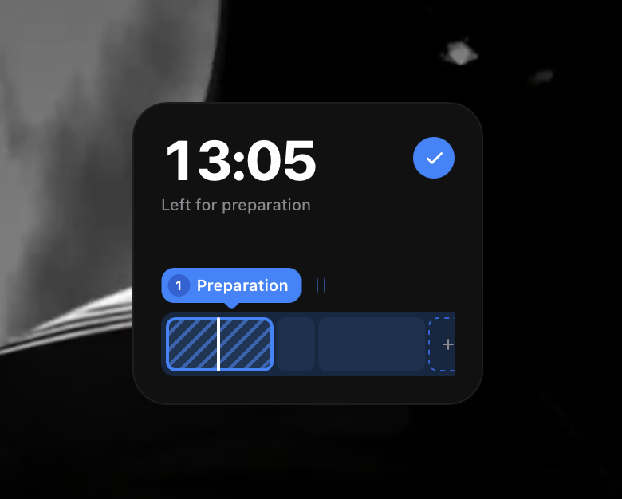

# Block Timer

A multi-block session timer that runs labeled tasks back-to-back on a scrolling track with click-to-jump, quick-add, and press-and-hold to delete.

## Features

- Sequential time blocks on a horizontally scrolling track with a live playhead
- Big `MM:SS` clock with per-block caption (`Left for …`, `Paused`, `Session complete`)
- Click any block to jump to it; check button finishes the current block early
- `+` cell opens an add-task modal (name + minutes, 1–60)
- Press-and-hold a block for 2s to delete it (session time reflows automatically)
- Keyboard shortcuts: `Space` (play/pause), `←` / `→` (prev/next block)

## How it works

- `index.jsx` renders the `SessionList` component — one `elapsed` value in seconds drives the clock, playhead, and active block.
- A `100ms` interval advances `elapsed`; a short handover pause rests the clock on `00:00` between blocks.
- Block widths scale with duration (`pxPerSec`), so long sessions widen the strip instead of squeezing cells.

## Customization

- **Default plan**: edit the initial `planItems` state in `index.jsx` (default is one 25-minute `Preparation` block).
- **Timing**: adjust `TICK_MS`, `HANDOVER_MS`, `HOLD_TO_DELETE_MS`, and `ARM_DELAY_MS` at the top of `index.jsx`.
- **Sizing**: change the `width` / `height` exports (`220` / `190`).
- **Position on screen**: adjust the `x` / `y` exports.
- **Colors**: edit the `COLOR` object (`card`, `accent`, `track`, `cell`, `delete`).

## Notes

- No shell `command` is used — this widget is pure UI state, so it has no `refreshFrequency`.
- At least one block is always kept; the last block cannot be deleted.
- Respects `prefers-reduced-motion` for handover and scroll animations.

## License

MIT
